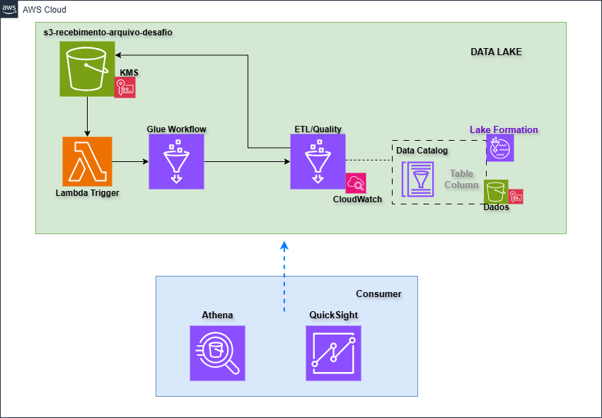

# Desafio - Arquitetura, Aplicação e IaC

Este repositório implementa uma arquitetura de ingestão e processamento de dados na AWS com orquestração via Glue Workflow, execução ETL em Glue Job, governança de catálogo com Glue Catalog/Lake Formation e gatilho inicial por Lambda.

## Visão geral

O projeto está organizado em duas frentes principais:

- app: código de aplicação (ETL Glue, Lambda e SQL)
- infra: infraestrutura como código com Terraform

Objetivo funcional:

- Receber dados (CSV) em bucket de entrada
- Processar e padronizar os dados com Glue (Spark)
- Executar regras de qualidade de dados
- Persistir saída em Data Lake (S3 + Glue Catalog)
- Disponibilizar consultas analíticas adicionais

## Arquitetura AWS

Serviços utilizados:

- Amazon S3
- AWS Glue (Job, Catalog Database/Table, Crawler, Workflow/Trigger)
- AWS Lambda
- AWS Lake Formation
- Amazon CloudWatch Logs
- IAM (roles e políticas)

Fluxo macro:

1. Um arquivo é disponibilizado no bucket de recebimento.
2. A função Lambda inicia o Glue Workflow.
3. O Workflow dispara o Glue Job principal.
4. O Job lê CSV do S3, tipa colunas, aplica validações de qualidade e adiciona partição por data.
5. O resultado é escrito na tabela externa do Glue Catalog apontando para S3 do Data Lake.
6. O Crawler atualiza metadados/partições conforme configuração.

## Aplicação (pasta app)

### app/glue/src

- main.py:
	- Job ETL principal.
	- Lê CSV do bucket de recebimento.
	- Seleciona e converte colunas para string.
	- Cria coluna anomesdia para particionamento.
	- Executa Data Quality com Great Expectations.
	- Escreve no catálogo Glue via SparkCatalog.

- desafio_1.py:
	- Lógica analítica para transações do tipo sale.
	- Para cada receiving_address, obtém transação mais recente.
	- Retorna top 3 por amount.

- desafio_2.py:
	- Calcula média de risk_score por location_region.
	- Ordena do maior para o menor.

### app/glue/utils

- spark_engine.py: instancia SparkSession com Hive Support e configurações padrão.
- spark_connector.py: leitura de arquivos por formato/opções.
- spark_catalog.py: escrita de DataFrame em tabela do catálogo Glue com alinhamento de schema.
- quality/:
	- data_quality/DataQuality.py: motor de execução de regras de qualidade.
	- expectation/: implementações de expectativas (não nulo, único, valores em lista).
	- reader/JSONFileReader.py: leitura da configuração JSON de regras.
	- config/config.json: regras de qualidade por coluna.
	- utils/utils.py: transformação do resultado de validação em DataFrame.

### app/lambda/src

- main.py:
	- Handler que chama start_workflow_run para o workflow-desafio.

### app/sql

- query_a.sql e query_b.sql:
	- consultas analíticas para cenários de vendas por vendedor/loja e evolução temporal de vendas.

## Infraestrutura IaC (pasta infra)

### provider e backend

- provider.tf:
	- provider AWS em us-east-1.
	- backend remoto Terraform no S3.

### variáveis e dados auxiliares

- variables.tf: parâmetros de região, buckets, nomes de banco/tabela e Glue Job.
- terraform.tfvars: valores concretos do ambiente.
- data.tf: contexto da conta/identidade corrente.

### armazenamento (S3)

- s3.tf:
	- bucket de recebimento de arquivo.
	- bucket do Data Lake.
	- bucket de scripts.
	- bloqueio de acesso público.
	- lifecycle para expiração de objetos.

### catálogo e descoberta de dados

- glue_catalog.tf:
	- aws_glue_catalog_database.
	- aws_glue_catalog_table externa (Parquet) com partição anomesdia.
	- aws_glue_crawler para varredura do bucket do Data Lake.

### processamento e orquestração

- glue_job.tf:
	- definição do Glue Job (Glue 4.0, G.1X, 2 workers).
	- argumentos padrão (TempDir, Data Catalog, módulos extras etc.).
	- role e política IAM para acesso a S3, Glue, Lake Formation, CloudWatch e KMS.

- glue_workflow.tf:
	- workflow-desafio.
	- trigger on-demand que dispara o Glue Job.

### governança e segurança

- lakeformation.tf:
	- admin do data lake.
	- role/policy para Glue e Lake Formation.
	- registro do bucket do Data Lake como recurso no Lake Formation.

### integração e observabilidade

- lambda.tf:
	- função Lambda que inicia o Workflow do Glue.
	- role e anexos de política para execução e acesso ao Glue.
	- permissão para invocação pela origem S3 (lambda permission).

- cloudwatch.tf:
	- log group para logs de execução.

- outputs.tf:
	- arquivo atualmente sem outputs definidos.

## Empacotamento e publicação

O Makefile automatiza:

- geração de utils.zip para dependências do Glue
- geração de lambda.zip
- upload de utils.zip e script principal para o bucket de scripts

## Execução local do Glue main com Docker

Foi criada uma pasta dedicada para executar localmente, em Docker, a logica principal do Glue main (transformacao + data quality), sem depender do runtime AWS Glue.

- Pasta: docker/glue-main-local
- Guia detalhado: docker/glue-main-local/README.md

Comandos rapidos:

```bash
docker build -f docker/glue-main-local/Dockerfile -t desafio-glue-main-local .

docker run --rm \
	-v "$(pwd)/data:/opt/project/data" \
	-v "$(pwd)/output:/opt/project/output" \
	desafio-glue-main-local
```

## Evidências

### Arquitetura da solução



### Execução do Glue Job


### Resultado de Data Quality


### Evidências complementares (PDF)

- [Athena - Consulta](img/Athena%20-%20Consulta.pdf)
- [Glue Catalog - Tabela](img/Glue%20Catalog%20-%20Tabela.pdf)